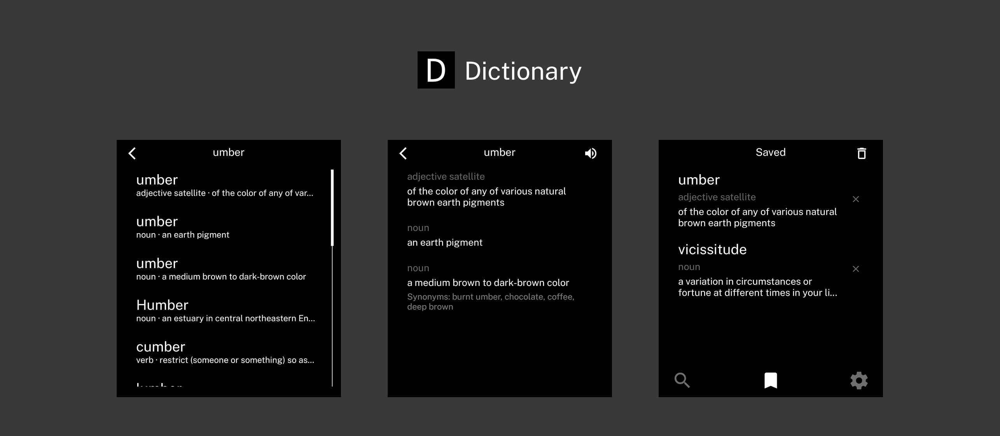

An offline dictionary app for the Light Phone III.

## Features

- Dictionary search using [Open English Wordnet](https://github.com/globalwordnet/english-wordnet) as database
- Word pronunciation using text-to-speech with adjustable voice speed
- Save words for later review

## Installation

The latest APK is available in [releases](https://github.com/garado/metronome/releases/).

I recommend using [Obtainium](https://github.com/ImranR98/Obtainium) and adding the repository's URL to receive updates.

## Acknowledgements

Thanks [Vandam](https://github.com/vandamd) for creating [light-template](https://github.com/vandamd/light-template), which made this app possible. If you enjoy this app, [consider sponsoring him](https://github.com/sponsors/vandamd)!
